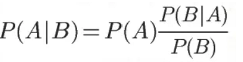
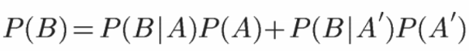

贝叶斯理论
=================

1. 贝叶斯定理有什么用？
2. 什么是贝叶斯定理？
3. 贝叶斯定理的应用案例
4. 生活中的贝叶斯思维

## 全概率公式

## 贝叶斯与梯度

Bayesian是以积分为基础的方法，Frequentist是以求导为基础。在计算机被发明以前，积分和求导的计算难度完全不是一个维度上的... 即使在计算机问世后，高维度的积分（high-dimensional data）仍然是一个巨大的挑战，许多贝叶斯学派的统计学家因此投身于各种approximation method的探索中。

直到上世纪90年代MCMC在统计学中革命性的应用，这一局面才被打破。借助MCMC，贝叶斯统计学家常常可以跳过令人头皮发麻的高维积分，直接从posterior distribution中抽取样本。贝叶斯方法本来就是一个有哲学基础，也比较有意思的方法，计算上的瓶颈一旦突破，自然也就活络了起来。

