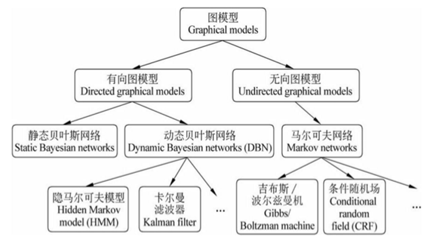

概率图模型(PGMs)
=====
   

概率图模型大致可以分为两种，directed graphical model(又称贝叶斯网络）和undirected graphical model（又称马尔可夫随机场）。

## 贝叶斯网络
贝叶斯网络由Judea Pearl 教授发明于上世界80年代，这项工作获得了2011年图灵奖。马尔可夫随机场最早被物理学家用于对原子进行建模，其中的代表作Ising model获得过诺贝尔奖。图灵奖+诺贝尔奖，PGM的重要性可见一斑。另外，PGM是将人工智能（AI）的研究热点从传统AI(如逻辑、推理、知识表示）转向机器学习的重要工作（其他起到这一作用的工作有支持向量机、决策树、boosting等）。

## 概率图模型在实际中（包括工业界）的应用非常广泛与成功
这里举几个例子。隐马尔可夫模型（HMM）是语音识别的支柱模型，高斯混合模型（GMM）及其变种K-means是数据聚类的最基本模型，条件随机场（CRF）广泛应用于自然语言处理（如词性标注，命名实体识别），Ising模型获得过诺贝尔奖，话题模型在工业界大量使用(如腾讯的推荐系统）。等等。

## PGM优雅的理论  
机器学习的一个核心任务是从观测到的数据中挖掘隐含的知识，而概率图模型是实现这一任务的一种很elegant，principled的手段。
PGM巧妙地结合了图论和概率论。从图论的角度，PGM是一个图，包含结点与边。结点可以分为两类：隐含结点和观测结点。边可以是有向的或者是无向的。从概率论的角度，PGM是一个概率分布，图中的结点对应于随机变量，边对应于随机变量 dependency或者correlation关系。给定一个实际问题，我们通常会观测到一些数据，并且希望能够挖掘出隐含在数据中的知识。怎么用PGM实现呢？我们构建一个图，用观测结点表示观测到的数据，用隐含结点表示潜在的知识，用边来描述知识与数据的相互关系，最后获得一个概率分布。给定概率分布之后，通过进行两个任务：inference (给定观测结点，推断隐含结点的后验分布）和learning(学习这个概率分布的参数），来获取知识。PGM的强大之处在于，不管数据和知识多复杂，我们的处理手段是一样的：建一个图，定义一个概率分布，进行inference和learning。这对于描述复杂的实际问题，构建大型的人工智能系统来说，是非常重要的。

## 总结
PGM在你的问题上不work,并不代表它本身不work,而是你没有把它弄work。

